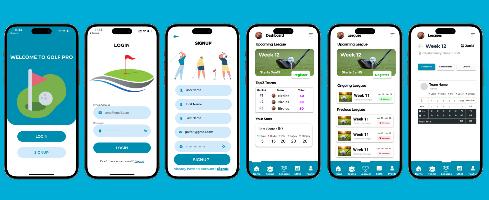

# Golf Pro : Digitalizing Golfing Experience

Welcome to the UI-Mobile-Team React Native project! This project aims to digitalize the team creation, league registration and maintaining scorecards on cloud.




This README provides instructions on setting up and running the project on your local machine.

## Prerequisites

Before you begin, make sure you have the following installed:

- [Node.js](https://nodejs.org/) (including npm)
- [Expo CLI](https://docs.expo.dev/get-started/installation/)

## Getting Started

1. Clone the repository to your local machine:

   ```bash
   git clone git@github.com:ACS-Project-Team1/UI-Mobile-Team.git

2. Navigate to the project directory:

   ```bash
   cd UI-Mobile-Team

3. Install dependencies:

   ```bash
   npm install

## Running the App

To start the development server and run the app, use the following command:

  ```bash
   expo start
```

This will open the Expo DevTools in your default web browser. You can then run the app on an emulator, simulator, or a physical device.


